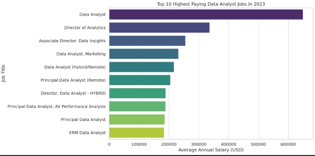

# INTRODUCTION
Dive into the data job market! Focusing on data analyst roles, this project explores top-paying jobs, in-demand skills, and where high demand meets high salary in data analytics.

SQL queries? Check them out here:
[project_sql folder](/project_sql/)

# BACKGROUND
Driven by a quest to navigate the data analyst job market more effectively, this project was born from a desire to pinpoint top-paid and in-demand skills, streamlining others to work to find optimal jobs.

# THE QUESTIONS I WANTED TO ANSWER THROUGH SQL QUERIES WERE:
1. What are the top-paying data analyst jobs?
2. What skills are required for these top-paying jobs?
3. What skills are most in-demand for data analysts?
4. Which skills are associated with higher salaries?
5. What are the most optimal skills to learn?

# TOOLS I USED
- **SQL**: The backbone of my analysis, allowing me to query the database and unearth critical insights.
- **PostgresSQL**: The chosen database management system, ideal for handling the job posting data.
- **Visual Studio Code**: My go-to for database management and executing SQL queries.
- **Git & Github**: Essential for version control and sharing my SQL scripts analysis, ensuring collaboration and project tracking.

# THE ANALYSIS
To identify the highest-paying roles, I filtered data analyst positions by average yearly salary and location, focusing on remote jobs. This query highlights the high paying opportunities in the field.

### 1. Top Paying Data Analyst Jobs
I analyze job market data to uncover insights that help professionals understand trends, especially in high-paying remote roles.

Here’s an example where I used SQL to extract the Top 10 Highest-Paying Remote Data Analyst Jobs for 2023.

```sql
SELECT 
    job_id,
    job_title,
    job_location,
    job_schedule_type,
    salary_year_avg,
    job_posted_date,
    name AS company_name
FROM
    job_postings_fact
LEFT JOIN company_dim ON job_postings_fact.company_id = company_dim.company_id
WHERE
    job_title_short = 'Data Analyst' AND
    job_location = 'Anywhere' AND
    salary_year_avg IS NOT NULL
ORDER BY
    salary_year_avg DESC
LIMIT 10;
```
Here's the breakdown of the top data analyst jobs in 2023:

- **Wide Salary Range:** Top 10 paying data analyst roles span from $184,000 to $650,000, indicating significant salary potential in the field.
- **Diverse Employers:** Companies like SmartAsset, Meta, and AT&T are among those offering high salaries, showing a broad interest accross different industries.
- **Job Title Variety:** There's a high diversity in job titles, from Data Analyst to Director of Analytics, reflecting varied roles and specializations within data analytics.




*Bar Graph visualizing the salary for the top 10 salaries for data analysts: ChatGPT generate this graph from my SQL queries results*

### 2. Skills for Top Paying Jobs
To understand what skills are required for the top-paying jobs, I joined the job postings with the skills data, providing insights into what employers value for high-compensation roles.

```sql
WITH top_paying_jobs AS (
    SELECT 
        job_id,
        job_title,
        salary_year_avg,
        name AS company_name
    FROM
        job_postings_fact
    LEFT JOIN company_dim ON job_postings_fact.company_id = company_dim.company_id
    WHERE
        job_title_short = 'Data Analyst' AND
        job_location = 'Anywhere' AND
        salary_year_avg IS NOT NULL
    ORDER BY
        salary_year_avg DESC
    LIMIT 10
)

SELECT 
    top_paying_jobs.*,
    skills
FROM 
    top_paying_jobs
INNER JOIN skills_job_dim ON top_paying_jobs.job_id = skills_job_dim.job_id
INNER JOIN skills_dim ON skills_job_dim.skill_id = skills_dim.skill_id
ORDER BY 
    salary_year_avg DESC;
```

Here's the breakdown of the most demanded skills for the top 10 highest paying data analyst jobs in 2023.

- **SQL** is leading with a bold count of 8
- **PYTHON** follows closely with a bold count of 7
- **TABLEAU** is also highly sought after, with a bold count of 6. Other skills like **R**, **Snowflake**, **Pandas**,and **Excel** show varying degrees of demand.


<<<<<<< HEAD
Bar graph visualizing the count of skill for the top 10 paying jobs for data analysts; Chatgpt generate this graph from my SQL query results.

# 3. In-Demand Skills for Data Analyst
This query helped identify the skill most frequently requested in job postings, directing focus to areas with high demand.

```sql
SELECT
    skills,
    COUNT(skills_job_dim.job_id) AS demand_count
FROM job_postings_fact
INNER JOIN skills_job_dim ON job_postings_fact.job_id = skills_job_dim.job_id
INNER JOIN skills_dim ON skills_job_dim.skill_id = skills_dim.skill_id
WHERE
    job_title_short = 'Data Analyst' AND
    job_work_from_home = TRUE
GROUP BY
    skills
ORDER BY
    demand_count DESC
LIMIT 5;
```

Here's the breakdown of the most demanded skills for data analyst in 2023

-**SQL** and **Excel** remain fundamental, emphasizing the need for strong foundational skills in data processing and spreadsheet manipulation.
-**Programming** and **Visualization Tools** like **Python**, **Tableau** and **Power BI** are essential, pointing towards the increasing importance of technical skills in data storytelling and desicion support.

*Table of the demand for the top 5 skills in data analyst job postings*

### 4. Skill Based on Salary
Exploring the average salaries associated with different skills revealed which are the highest paying.

```sql
SELECT
    skills,
    ROUND(AVG(salary_year_avg), 0) AS avg_salary
FROM job_postings_fact
INNER JOIN skills_job_dim ON job_postings_fact.job_id = skills_job_dim.job_id
INNER JOIN skills_dim ON skills_job_dim.skill_id = skills_dim.skill_id
WHERE
    job_title_short = 'Data Analyst' AND
    salary_year_avg IS NOT NULL AND
    job_work_from_home = TRUE
GROUP BY
    skills
ORDER BY
    avg_salary DESC
LIMIT 25;
```
*Table of the average salary for the top 10 paying skills for data analyts*

### 5. Most Optimal Skills to Learn

Combining insights from demand and salary data, this query aimed to pinpoint skills that are both in high demand and have high salaries, offering a strategic focus for skill development.

```sql
WITH skills_demand AS(
SELECT
    skills_dim.skill_id,
    skills_dim.skills,
    COUNT(skills_job_dim.job_id) AS demand_count
FROM job_postings_fact
INNER JOIN skills_job_dim ON job_postings_fact.job_id = skills_job_dim.job_id
INNER JOIN skills_dim ON skills_job_dim.skill_id = skills_dim.skill_id
WHERE
    job_title_short = 'Data Analyst' AND
    salary_year_avg IS NOT NULL AND
    job_work_from_home = TRUE
GROUP BY
    skills_dim.skill_id
), average_salary AS (
SELECT
    skills_job_dim.skill_id,
    ROUND(AVG(salary_year_avg), 0) AS avg_salary
FROM job_postings_fact
INNER JOIN skills_job_dim ON job_postings_fact.job_id = skills_job_dim.job_id
INNER JOIN skills_dim ON skills_job_dim.skill_id = skills_dim.skill_id
WHERE
    job_title_short = 'Data Analyst' AND
    salary_year_avg IS NOT NULL AND
    job_work_from_home = TRUE
GROUP BY
    skills_job_dim.skill_id
)   

SELECT
    skills_demand.skill_id,
    skills_demand.skills,
    demand_count,
    avg_salary
FROM 
    skills_demand
INNER JOIN average_salary ON skills_demand.skill_id = average_salary.skill_id
WHERE
    demand_count > 10
ORDER BY
    avg_salary DESC,
    demand_count DESC
LIMIT 25;
```

*Table of the most optimal skills for data analyst sorted by salary*

# WHAT I LEARNED 
Throughout this adventure, I've turbocharged my SQL toolkit with some serious firepower:

- **Complex Query Crafting:** Mastered the art of advance SQL, merging tables a pro and wielding WITH clauses for ninja-level temp table maneuvers.

- **Data Aggregatiom:** Got cozy with GROUP BY and turned aggregate functions like COUNT() and AVG() into my data-summarizing sidekicks.

- **Analytical Wizardry:** Leveled up my realworld puzzle-solving skills, turning questions into actionable, insightful SQL queries.

# CONCLUSION

### Insights

1. **Top-Paying Data Analyst Jobs**: The highest-paying jobs for data analysts that allow remote work offer a wide range of salaries, the highest at $650,000!

2. **Skills for Top-Paying Jobs**: High-paying data analyst jobs require advanced proficiency in SQL, suggesting it's a critical skill for earning a top salary.

3. **Most In-Demand Skills**: SQL is also the most demanded skill in data analyst job market, thus making it essential for job seekers.

**Skills with Higher Salaries**: Specialized skills, such as SVN and Solidity, are associated with the highest average salaries, indicating a premium on niche expertise.

5. **Optimal Skills for Job Market Value**: SQL leads in demand and offers for a high average salary, positioning it as one of the most optimal skills for data analysts to learn to maximize their market value.

### Closing Thougths
This project enhanced my SQL skills and provided valuable insights into the data analyst job market. The findings from the analysis serve as a guide to prioritizing skill development and job search efforts. Aspiring data analysts can better position themselves in a competitive job market by focusing on high-demand, high-salary skills. This exploration highlights the importance of continious learning and adaptation to emerging trends in the field of data analytics. 


